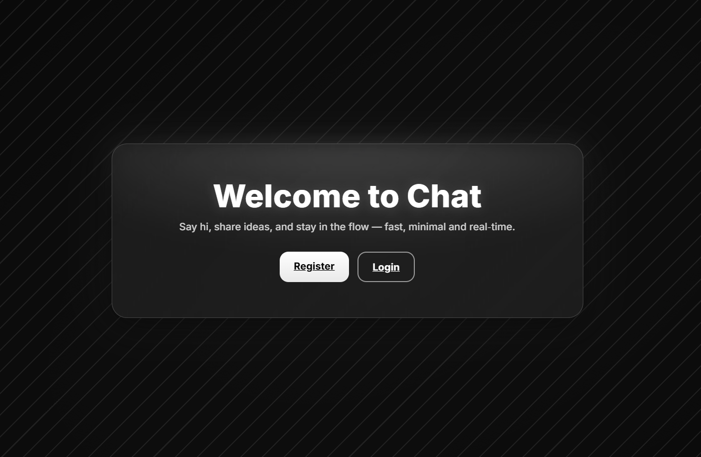
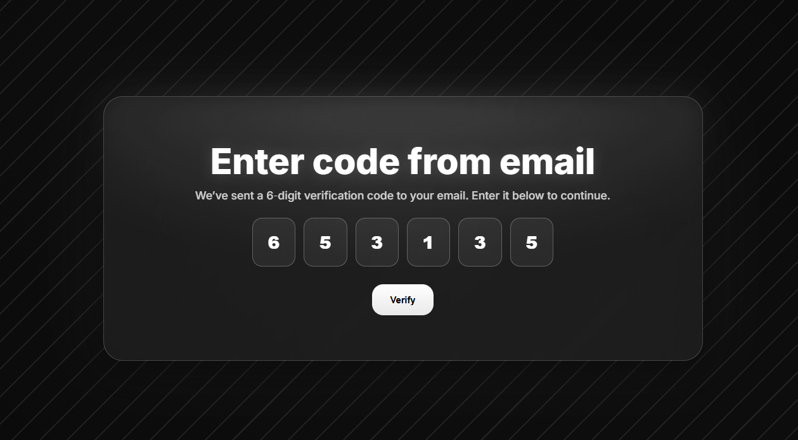
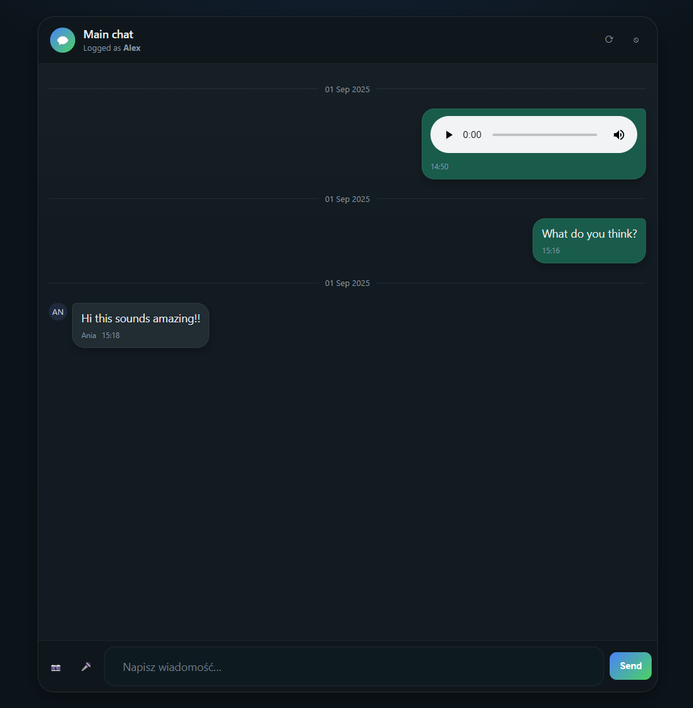

# Encrypted Chat (Flask)

Privacy-first chat built with Python/Flask plus a bit of JS/HTML/CSS.  
Supports email allow-list, two-step verification, encrypted text at rest, image uploads, and voice messages. Messages show sender and time and are intentionally non-deletable.

**Production:** https://mychat-ak8s.onrender.com

---

## Features

- Email allow-list (`valid_emails.txt`): only listed addresses can register.
- Two-step verification via one-time code sent to the user’s email.
- Text messages encrypted at rest with `cryptography.Fernet`.
- Image and voice message uploads; inline `` and `<audio>` rendering.
- Identity and timestamp visible for every message.
- No deletion endpoint by design.

---

## Tech

- Backend: Flask, Flask-Login, Flask-SQLAlchemy, SQLAlchemy
- Crypto: `cryptography.Fernet`
- Frontend: Vanilla JS + HTML/CSS (MediaRecorder for voice notes)
- Storage: DB for users/messages; files stored under `uploads/` with unique names

---

## Data Model (simplified)

**users**
- `id`, `username` (unique), `email` (unique), `password` (hash)

**messages**
- `id`, `text` (encrypted, nullable), `file_path` (URL, nullable), `type` (`text|image|audio|file`)
- `date`, `time`, `user_id` → users.id

Text is encrypted before DB insert. Files live in `uploads/` and are referenced by `file_path`.

---

## API (brief)

- `GET /chat` – UI (server render + JS)
- `POST /api/messages` – create text message  
  Request: `{ "content": "Hello" }`  
  Response includes `type: "text"`.
- `POST /api/messages/file` – multipart upload (`file`) for image/audio; server assigns unique filename and returns `type: "image" | "audio" | "file"` with `content` as `/uploads/<name>`.
- `GET /api/messages?before_id=<id>` – older messages (pagination)
- `GET /uploads/<filename>` – serve files (public by default)

---

## Configuration

Create `.env`:

